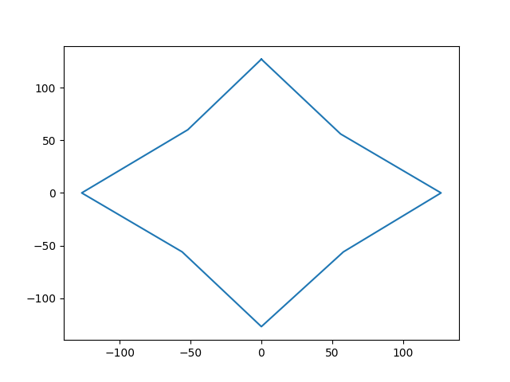

# Tiny-ESS-Adapter
A DIY Adapter using Arduino or Atmel ATTiny

**For Ocarina of Time on Wii Virtual Console only**

Obligatory disclaimer: YOU are responsible for your own safety and the safety of your equipment.

## 1. Introduction
Wii Virtual Console (VC) is currently the fastest platform in many categories of Ocarina of Time speedrunning. This is due to version-specific glitches, as well as decreased loading times. There is a critical problem with this: VC actually remaps your analog stick inputs. This drastically increases the difficulty of all variations of the Extended Super Slide (ESS.) It also makes it much more difficult to aim first person items such as the hookshot and the bow.

An ESS adapter is a device which modifies your controller inputs, and then feeds the modified inputs into your console, in an attempt to reverse VC's remap of your analog stick. It can also do things like remap your buttons.

### Files in this repository:
* vc.ods (Spreadsheet containing the Virtual Console remap of your gamecube controller. May not format correctly in excel. Also its a bit of a messy spreadsheet but should have all pertinent data for creating a custom remap.)
* mappings.txt (This is a list of mappings, with a brief description and credit to the creator if not created by me.)
* 1d-remap.ino (Arduino sketch for 1d remap.)
* 1.5d-remap.ino (Arduino sketch for 1d remap of each axis separately. I made this because I like a bit more dead zone in my X axis.)

## 2. Adapter Rules
Taken from the Ocarina of Time Speedrunning discord: [https://discord.gg/DfjKaQ](https://discord.gg/DfjKaQ)
* Analog signals are mapped only to analog signals.
* Digital signals can be mapped to analog, but not the reverse. 
* The control stick output must be a monotonically increasing sequence. In other words, if one input value is greater than or equal to another input value, their respective outputs must share that relationship. This preserves the ordering of deadzone → ESS → walking → running.
* Minimum input must be mapped to minimum output. In other words, neutral must map to neutral.
* The adapter may not add or remove functionality to the game. Turbo, macros, and mapping multiple input sources to movement are examples of added functionality. Mapping the entire stick to ESS is an example of loss of functionality.  Link must retain all of his normally accessible actions and movement options.

## 3. 1D vs 2D Remap
A gamecube controller has a range of 0 to 255 on each axis. For the sake of human readability, we will use the scale -127 to 127 instead. For example, the neutral position on the thumbstick would be 0,0. Straight forward would be 0,127. Left is -127,0, etc.
However, due to the plastic controller casing, the actual highest attainable value for the cardinal directions is more like 105, and the diagonals are around 75.
### 2-dimensional Remap
Since each axis has 256 possible values, there are a total of 65,566 possible coordinates (256x256) on a gamecube controller stick. Though again, due to the controller casing its actually closer to 32,000. A 2D remap changes every point on the 2 dimensional spectrum of coordinates to another set of coordinates. There are some programming tricks to reduce this number by 3/4, but at a minimum you would need a remap table of at least 8,000 modified coordinates programmed on your ESS adapter for a full 2D remap.
### 1-dimensional Remap
A 1D remap reduces this to 128 values. Instead of remapping every point in the spectrum of points, you simply remap the X and Y axes themselves. That would be a total of 512 values (256+256), however we can reduce that by 3/4 using the same programming tricks mentioned above.
### Which is better?
To the best of my knowledge, they are exactly the same. The reason for this is the hard limit on the diagonals set by the Virtual Console remap. Let me explain.

I plugged an arduino dev board into my Wii without any sort of remapping, and fed every possible set of coordinates into my Wii. I used the GZ practice ROM to display what VC was doing with my inputs, and recorded every output. I then put all of this into a spreadsheet, split up the X and Y data, color coded, and began to analyze what was happening under the hood. What I found is that VC remaps your inputs in a linear fashion up to a certain point. Beyond that point X values will slowly begin to change as you increase Y, and vice versa. The other axis will skew even more as you approach a diagonal (northeast, northwest, etc..)

See the following images for (hopefully) clarification:

[X values skewing](./images/x_skew.png)

[Y values skewing](./images/y_skew.png)

As you can see, no matter how far you move your stick toward the northeast notch of your controller, **you will never exceed a 58,58 in-game value on a diagonal.**

Here's the good news: Every single coordinate you need for a full range of movement in Ocarina of Time falls **within the linear range of VC's remap.**

The result of this is that for Ocarina of Time on Wii Virtual Console, regardless of 1d or 2d mapping, your in-game thumbstick mapping will always look somewhat like this:

## 4. Arduino vs ATTiny

Arduino is going to be the best option for someone with absolutely no electronics experience. You can pick up an Arduino Nano from Sparkfun for $10. [https://www.sparkfun.com/products/11113](https://www.sparkfun.com/products/11113) You can also pick up some knock-offs on Amazon or eBay for cheaper, but there's no telling if they were assembled using quality parts, so buy at your own risk. I have been using a knockoff Arduino ATMega 2560 made by Elegoo for years with no problems, but results may vary. Soldering will be recommended, but not necessarily required if you use Arduino to power your adapter.

I made my adapter using the ATTiny85 because I had some on hand, and they cost only $2 for a very versatile chip. The downside is you need some way to program it. You can use an ATTiny AVR programmer ($15-$20), or any Arduino board, though if you use Arduino it's a more involved process which I will cover in the tutorial. Also for the ATTiny adapter, soldering is required, unless you want to leave it indefinitely on a breadboard.
